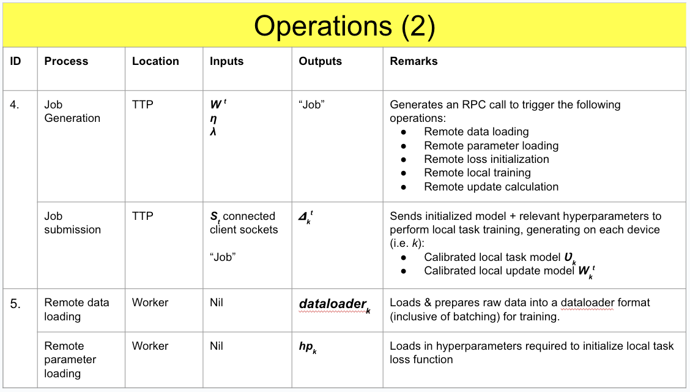

## Usage
```
# Start 2 worker Clusters, each comprising of 1 head Ray node and 1 worker Ray node 
docker compose \
    -f docker-compose_workerCluster_1.yml \
    -f docker-compose_workerCluster_2.yml \
    up [--build]

# Terminate worker clusters
docker-compose \
    -f docker-compose_workerCluster_1.yml \
    -f docker-compose_workerCluster_2.yml \
    down
```

## Fedmt 


Federated multitask learning is to solve different similar tasks at the same time in a federated setting, where each device has its own task/objective. This algorithm aims to optimise multiple objectives at the same time by exploiting the similarities and differences across different tasks. For example, for 2 models with the same input of a image of a flower, 1 model identifies the flower type and another identifies the flower color. 

The multi-task learning objective here in FL is to minimise the loss of local models. Here, in order to incorporate global information, the objective uses an L2 regularizer to enforce local models to be closer to the optimal global model. Λ (lambda) is a hyperparameter that controls the interpolation between local and global models. When λ is set to 0, the objective here is reduced to training local models; as λ grows large, it recovers global model optimization. Fk(Wk) is the local loss for the devices.





## UML Diagram


## Learnings 

